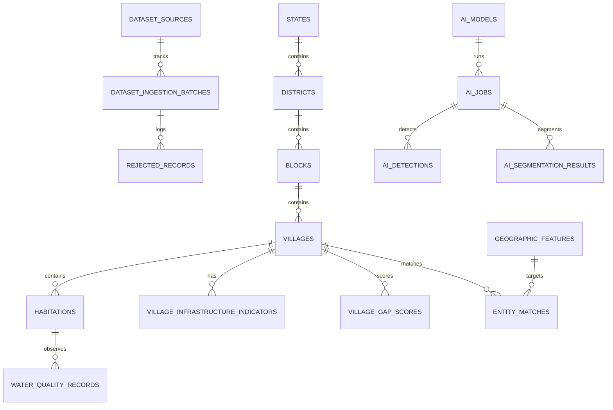

# GramDrishti AI — Canonical Database Design & ER Specification

**Document Version:** 2.0.0  
**Target RDBMS:** MySQL 8.0 / InnoDB Engine  
**Character Set:** `utf8mb4` / Collation: `utf8mb4_unicode_ci`  
**Location:** `/docs/DATABASE_DESIGN.md`

---

## 1. Schema Architecture & Entity Relationship Diagram

The GramDrishti AI database architecture is organized into four distinct tiers:
1. **Lineage & Ingestion Control Tier**: Tracks source datasets, batches, staging records, and validation rejects.
2. **Canonical Administrative & Geographic Hierarchy**: Normalized 6-level administrative structure (`states` $\rightarrow$ `districts` $\rightarrow$ `blocks` $\rightarrow$ `villages` $\rightarrow$ `habitations` $\rightarrow$ `water_quality_records`).
3. **Geospatial & Entity Resolution Tier**: Stores Survey of India geographic features (`geographic_features`) and cross-dataset linkage decisions (`entity_matches`).
4. **Analytics, Gap Intelligence & AI Tier**: Stores multi-sector infrastructure indicators (`village_infrastructure_indicators`), versioned composite deficit scores (`village_gap_scores`), and computer vision detections/segmentations (`ai_models`, `ai_jobs`, `ai_detections`, `ai_segmentation_results`).



---

## 2. Table Specifications

### 2.1 Lineage & Source Registry

#### Table: `dataset_sources`
Tracks metadata for all 7 integrated datasets.
```sql
CREATE TABLE dataset_sources (
    id BIGINT AUTO_INCREMENT PRIMARY KEY,
    dataset_name VARCHAR(100) NOT NULL UNIQUE,
    description TEXT,
    source_type VARCHAR(50) NOT NULL, -- FILE, API, SATELLITE_ORBIT, SENSOR
    file_path VARCHAR(500) NOT NULL,
    record_count BIGINT DEFAULT 0,
    status VARCHAR(50) DEFAULT 'ACTIVE', -- ACTIVE, DEPRECATED, ARCHIVED
    version VARCHAR(50) DEFAULT '1.0',
    created_at DATETIME DEFAULT CURRENT_TIMESTAMP,
    updated_at DATETIME DEFAULT CURRENT_TIMESTAMP ON UPDATE CURRENT_TIMESTAMP
) ENGINE=InnoDB DEFAULT CHARSET=utf8mb4 COLLATE=utf8mb4_unicode_ci;
```

#### Table: `dataset_ingestion_batches`
Tracks execution runs, throughput, and error metrics for batch jobs.
```sql
CREATE TABLE dataset_ingestion_batches (
    id VARCHAR(64) PRIMARY KEY, -- UUID
    dataset_source_id BIGINT NOT NULL,
    started_at DATETIME NOT NULL,
    completed_at DATETIME NULL,
    records_processed BIGINT DEFAULT 0,
    records_inserted BIGINT DEFAULT 0,
    records_updated BIGINT DEFAULT 0,
    records_rejected BIGINT DEFAULT 0,
    status VARCHAR(50) NOT NULL, -- RUNNING, COMPLETED, FAILED, RESUMED
    error_message TEXT NULL,
    FOREIGN KEY (dataset_source_id) REFERENCES dataset_sources(id) ON DELETE CASCADE
) ENGINE=InnoDB DEFAULT CHARSET=utf8mb4 COLLATE=utf8mb4_unicode_ci;
```

#### Table: `rejected_records`
Preserves unparseable or out-of-bounds records for complete audit compliance.
```sql
CREATE TABLE rejected_records (
    id BIGINT AUTO_INCREMENT PRIMARY KEY,
    source_dataset VARCHAR(100) NOT NULL,
    source_file VARCHAR(255) NOT NULL,
    source_row BIGINT NOT NULL,
    reason VARCHAR(255) NOT NULL,
    raw_reference LONGTEXT NULL,
    created_at DATETIME DEFAULT CURRENT_TIMESTAMP,
    INDEX idx_rejected_dataset (source_dataset),
    INDEX idx_rejected_reason (reason)
) ENGINE=InnoDB DEFAULT CHARSET=utf8mb4 COLLATE=utf8mb4_unicode_ci;
```

---

### 2.2 Canonical Administrative Hierarchy

#### Table: `states`
```sql
CREATE TABLE states (
    id BIGINT AUTO_INCREMENT PRIMARY KEY,
    state_code VARCHAR(10) NOT NULL UNIQUE,
    state_name VARCHAR(100) NOT NULL UNIQUE,
    normalized_name VARCHAR(100) NOT NULL,
    created_at DATETIME DEFAULT CURRENT_TIMESTAMP,
    updated_at DATETIME DEFAULT CURRENT_TIMESTAMP ON UPDATE CURRENT_TIMESTAMP,
    INDEX idx_state_norm (normalized_name)
) ENGINE=InnoDB DEFAULT CHARSET=utf8mb4 COLLATE=utf8mb4_unicode_ci;
```

#### Table: `districts`
```sql
CREATE TABLE districts (
    id BIGINT AUTO_INCREMENT PRIMARY KEY,
    district_code VARCHAR(20) NOT NULL UNIQUE,
    state_id BIGINT NOT NULL,
    district_name VARCHAR(150) NOT NULL,
    normalized_name VARCHAR(150) NOT NULL,
    -- Demographic Indicators (Census 2011)
    population BIGINT NULL,
    literacy_rate DECIMAL(5,2) NULL,
    female_literacy_rate DECIMAL(5,2) NULL,
    sc_population BIGINT NULL,
    st_population BIGINT NULL,
    -- Economic Indicators (State GDP)
    gdp DECIMAL(18,2) NULL,
    gdp_year INT NULL,
    -- Education Indicators (Elementary 2015-16)
    school_count INT NULL,
    education_index DECIMAL(5,2) NULL,
    created_at DATETIME DEFAULT CURRENT_TIMESTAMP,
    updated_at DATETIME DEFAULT CURRENT_TIMESTAMP ON UPDATE CURRENT_TIMESTAMP,
    FOREIGN KEY (state_id) REFERENCES states(id) ON DELETE RESTRICT,
    INDEX idx_district_state (state_id),
    INDEX idx_district_norm (normalized_name)
) ENGINE=InnoDB DEFAULT CHARSET=utf8mb4 COLLATE=utf8mb4_unicode_ci;
```

#### Table: `blocks`
```sql
CREATE TABLE blocks (
    id BIGINT AUTO_INCREMENT PRIMARY KEY,
    district_id BIGINT NOT NULL,
    block_name VARCHAR(150) NOT NULL,
    normalized_name VARCHAR(150) NOT NULL,
    created_at DATETIME DEFAULT CURRENT_TIMESTAMP,
    updated_at DATETIME DEFAULT CURRENT_TIMESTAMP ON UPDATE CURRENT_TIMESTAMP,
    FOREIGN KEY (district_id) REFERENCES districts(id) ON DELETE CASCADE,
    UNIQUE KEY uk_district_block (district_id, normalized_name),
    INDEX idx_block_district (district_id),
    INDEX idx_block_norm (normalized_name)
) ENGINE=InnoDB DEFAULT CHARSET=utf8mb4 COLLATE=utf8mb4_unicode_ci;
```

#### Table: `villages`
```sql
CREATE TABLE villages (
    id BIGINT AUTO_INCREMENT PRIMARY KEY,
    village_code VARCHAR(50) NULL UNIQUE,
    block_id BIGINT NOT NULL,
    village_name VARCHAR(200) NOT NULL,
    normalized_name VARCHAR(200) NOT NULL,
    -- Spatial Coordinates
    latitude DECIMAL(10,7) NULL,
    longitude DECIMAL(10,7) NULL,
    -- Population Baseline
    population BIGINT DEFAULT 0,
    male_population BIGINT DEFAULT 0,
    female_population BIGINT DEFAULT 0,
    sc_population BIGINT DEFAULT 0,
    st_population BIGINT DEFAULT 0,
    -- Multi-Sector Infrastructure Scores (0-100 scale, computed by Analytics Engine)
    road_index DECIMAL(5,2) NULL,
    water_index DECIMAL(5,2) NULL,
    connectivity_index DECIMAL(5,2) NULL,
    education_index DECIMAL(5,2) NULL,
    healthcare_index DECIMAL(5,2) NULL,
    socioeconomic_index DECIMAL(5,2) NULL,
    -- AI Gap Intelligence
    infrastructure_gap_score DECIMAL(5,2) NULL,
    priority_tier VARCHAR(20) DEFAULT 'MEDIUM', -- CRITICAL, HIGH, MEDIUM, LOW
    score_confidence DECIMAL(5,2) NULL,
    data_completeness DECIMAL(5,2) DEFAULT 0.0,
    -- Metadata
    primary_data_source VARCHAR(100) NULL,
    is_deleted BOOLEAN DEFAULT FALSE,
    created_at DATETIME DEFAULT CURRENT_TIMESTAMP,
    updated_at DATETIME DEFAULT CURRENT_TIMESTAMP ON UPDATE CURRENT_TIMESTAMP,
    deleted_at DATETIME NULL,
    FOREIGN KEY (block_id) REFERENCES blocks(id) ON DELETE CASCADE,
    INDEX idx_village_block (block_id),
    INDEX idx_village_norm (normalized_name),
    INDEX idx_village_coords (latitude, longitude),
    INDEX idx_village_priority (priority_tier),
    INDEX idx_village_gap (infrastructure_gap_score)
) ENGINE=InnoDB DEFAULT CHARSET=utf8mb4 COLLATE=utf8mb4_unicode_ci;
```

#### Table: `habitations`
Stores master habitation entities with multi-year drinking water coverage history.
```sql
CREATE TABLE habitations (
    id BIGINT AUTO_INCREMENT PRIMARY KEY,
    village_id BIGINT NOT NULL,
    habitation_name VARCHAR(200) NOT NULL,
    normalized_name VARCHAR(200) NOT NULL,
    sc_population BIGINT DEFAULT 0,
    st_population BIGINT DEFAULT 0,
    general_population BIGINT DEFAULT 0,
    total_population BIGINT DEFAULT 0,
    coverage_status VARCHAR(50) NULL, -- Fully Covered [FC], Partially Covered [PC], Not Covered [NC]
    water_quality_status VARCHAR(50) NULL, -- SAFE, CONTAMINATED
    source_year INT NOT NULL, -- 2009, 2010, 2011, 2012
    created_at DATETIME DEFAULT CURRENT_TIMESTAMP,
    updated_at DATETIME DEFAULT CURRENT_TIMESTAMP ON UPDATE CURRENT_TIMESTAMP,
    FOREIGN KEY (village_id) REFERENCES villages(id) ON DELETE CASCADE,
    INDEX idx_habitation_village (village_id),
    INDEX idx_habitation_year (source_year),
    INDEX idx_habitation_status (coverage_status)
) ENGINE=InnoDB DEFAULT CHARSET=utf8mb4 COLLATE=utf8mb4_unicode_ci;
```

#### Table: `water_quality_records`
Stores specific chemical contamination observations (Fluoride, Arsenic, Iron, Salinity, Nitrate).
```sql
CREATE TABLE water_quality_records (
    id BIGINT AUTO_INCREMENT PRIMARY KEY,
    habitation_id BIGINT NOT NULL,
    parameter VARCHAR(50) NOT NULL, -- Fluoride, Arsenic, Iron, Salinity, Nitrate
    status VARCHAR(50) NOT NULL, -- AFFECTED, CONTAMINATED
    value DECIMAL(10,4) NULL, -- Actual measured value if available (preserves NULL when missing)
    unit VARCHAR(20) DEFAULT 'mg/L',
    source_year INT NOT NULL,
    created_at DATETIME DEFAULT CURRENT_TIMESTAMP,
    FOREIGN KEY (habitation_id) REFERENCES habitations(id) ON DELETE CASCADE,
    INDEX idx_water_habitation (habitation_id),
    INDEX idx_water_parameter (parameter),
    INDEX idx_water_year (source_year)
) ENGINE=InnoDB DEFAULT CHARSET=utf8mb4 COLLATE=utf8mb4_unicode_ci;
```

---

### 2.3 Survey of India Geospatial Features & Entity Resolution

#### Table: `geographic_features`
Houses the 1.28 Million Survey of India geospatial features (villages, rivers, water tanks, roads, hills).
```sql
CREATE TABLE geographic_features (
    id BIGINT AUTO_INCREMENT PRIMARY KEY,
    feature_type VARCHAR(100) NOT NULL, -- VILLAGE, HAMLET, RIVER, CANAL, WATER_TANK_SURVEYED, ROAD NAME, etc.
    feature_name VARCHAR(255) NOT NULL,
    normalized_name VARCHAR(255) NOT NULL,
    state_name VARCHAR(100) NULL,
    district_name VARCHAR(150) NULL,
    block_name VARCHAR(150) NULL,
    latitude DECIMAL(10,7) NOT NULL,
    longitude DECIMAL(10,7) NOT NULL,
    source VARCHAR(50) DEFAULT 'SURVEY_OF_INDIA',
    created_at DATETIME DEFAULT CURRENT_TIMESTAMP,
    INDEX idx_geo_feature_type (feature_type),
    INDEX idx_geo_norm (normalized_name),
    INDEX idx_geo_coords (latitude, longitude),
    INDEX idx_geo_state_dist (state_name, district_name)
) ENGINE=InnoDB DEFAULT CHARSET=utf8mb4 COLLATE=utf8mb4_unicode_ci;
```

#### Table: `entity_matches`
Preserves linkage confidence and review statuses across heterogeneous datasets.
```sql
CREATE TABLE entity_matches (
    id BIGINT AUTO_INCREMENT PRIMARY KEY,
    source_dataset VARCHAR(100) NOT NULL,
    source_record_id VARCHAR(255) NOT NULL,
    target_entity_type VARCHAR(50) NOT NULL, -- VILLAGE, DISTRICT, GEOGRAPHIC_FEATURE
    target_entity_id BIGINT NOT NULL,
    matching_method VARCHAR(100) NOT NULL, -- EXACT_HIERARCHY, PHONETIC_JARO_WINKLER, SPATIAL_PROXIMITY_BUFFER
    confidence_score DECIMAL(5,4) NOT NULL,
    status VARCHAR(50) NOT NULL, -- AUTO_MATCHED, REVIEW_REQUIRED, CONFIRMED, REJECTED, UNMATCHED
    created_at DATETIME DEFAULT CURRENT_TIMESTAMP,
    INDEX idx_match_target (target_entity_type, target_entity_id),
    INDEX idx_match_status (status),
    INDEX idx_match_confidence (confidence_score)
) ENGINE=InnoDB DEFAULT CHARSET=utf8mb4 COLLATE=utf8mb4_unicode_ci;
```

---

### 2.4 Infrastructure Indicator & Gap Scoring Layer

#### Table: `village_infrastructure_indicators`
Normalized multi-sector domain indicators.
```sql
CREATE TABLE village_infrastructure_indicators (
    id BIGINT AUTO_INCREMENT PRIMARY KEY,
    village_id BIGINT NOT NULL,
    indicator_type VARCHAR(50) NOT NULL, -- ROAD, WATER, CONNECTIVITY, EDUCATION, HEALTHCARE, DIGITAL_ACCESS, SOCIOECONOMIC, TRANSPORTATION
    indicator_value DECIMAL(12,4) NOT NULL,
    normalized_score DECIMAL(5,2) NOT NULL, -- 0.00 to 100.00
    source VARCHAR(100) NOT NULL,
    source_year INT NOT NULL,
    confidence DECIMAL(5,2) DEFAULT 1.0,
    created_at DATETIME DEFAULT CURRENT_TIMESTAMP,
    FOREIGN KEY (village_id) REFERENCES villages(id) ON DELETE CASCADE,
    INDEX idx_indicator_village (village_id),
    INDEX idx_indicator_type (indicator_type)
) ENGINE=InnoDB DEFAULT CHARSET=utf8mb4 COLLATE=utf8mb4_unicode_ci;
```

#### Table: `village_gap_scores`
Versioned overall deficit scores for dynamic re-indexing.
```sql
CREATE TABLE village_gap_scores (
    id BIGINT AUTO_INCREMENT PRIMARY KEY,
    village_id BIGINT NOT NULL,
    road_gap DECIMAL(5,2) NOT NULL,
    water_gap DECIMAL(5,2) NOT NULL,
    connectivity_gap DECIMAL(5,2) NOT NULL,
    education_gap DECIMAL(5,2) NOT NULL,
    healthcare_gap DECIMAL(5,2) NOT NULL,
    digital_gap DECIMAL(5,2) NOT NULL,
    transport_gap DECIMAL(5,2) NOT NULL,
    socioeconomic_gap DECIMAL(5,2) NOT NULL,
    overall_gap_score DECIMAL(5,2) NOT NULL,
    priority_tier VARCHAR(20) NOT NULL, -- CRITICAL, HIGH, MEDIUM, LOW
    confidence_score DECIMAL(5,2) NOT NULL,
    data_completeness DECIMAL(5,2) NOT NULL,
    calculation_version VARCHAR(20) NOT NULL, -- e.g. "v1.0.0-formula"
    calculated_at DATETIME DEFAULT CURRENT_TIMESTAMP,
    FOREIGN KEY (village_id) REFERENCES villages(id) ON DELETE CASCADE,
    INDEX idx_gap_village (village_id),
    INDEX idx_gap_tier (priority_tier),
    INDEX idx_gap_score (overall_gap_score)
) ENGINE=InnoDB DEFAULT CHARSET=utf8mb4 COLLATE=utf8mb4_unicode_ci;
```

---

### 2.5 AI & Computer Vision Inference Tables

```sql
CREATE TABLE ai_models (
    id BIGINT AUTO_INCREMENT PRIMARY KEY,
    model_name VARCHAR(100) NOT NULL,
    model_type VARCHAR(50) NOT NULL, -- OBJECT_DETECTION, SEMANTIC_SEGMENTATION
    version VARCHAR(50) NOT NULL,
    framework VARCHAR(50) NOT NULL, -- PyTorch, YOLOv8, ONNX
    classes JSON NOT NULL,
    accuracy DECIMAL(5,4) NULL,
    status VARCHAR(50) DEFAULT 'ACTIVE',
    created_at DATETIME DEFAULT CURRENT_TIMESTAMP
) ENGINE=InnoDB DEFAULT CHARSET=utf8mb4 COLLATE=utf8mb4_unicode_ci;

CREATE TABLE ai_jobs (
    id VARCHAR(64) PRIMARY KEY, -- UUID
    project_id BIGINT NULL,
    model_id BIGINT NOT NULL,
    job_type VARCHAR(50) NOT NULL,
    status VARCHAR(50) NOT NULL, -- PENDING, PROCESSING, COMPLETED, FAILED
    progress INT DEFAULT 0,
    started_at DATETIME NULL,
    completed_at DATETIME NULL,
    error_message TEXT NULL,
    FOREIGN KEY (model_id) REFERENCES ai_models(id) ON DELETE RESTRICT
) ENGINE=InnoDB DEFAULT CHARSET=utf8mb4 COLLATE=utf8mb4_unicode_ci;

CREATE TABLE ai_detections (
    id BIGINT AUTO_INCREMENT PRIMARY KEY,
    job_id VARCHAR(64) NOT NULL,
    image_reference VARCHAR(500) NOT NULL,
    class_name VARCHAR(100) NOT NULL,
    confidence DECIMAL(5,4) NOT NULL,
    x_center DECIMAL(7,6) NOT NULL,
    y_center DECIMAL(7,6) NOT NULL,
    width DECIMAL(7,6) NOT NULL,
    height DECIMAL(7,6) NOT NULL,
    created_at DATETIME DEFAULT CURRENT_TIMESTAMP,
    FOREIGN KEY (job_id) REFERENCES ai_jobs(id) ON DELETE CASCADE,
    INDEX idx_detection_job (job_id)
) ENGINE=InnoDB DEFAULT CHARSET=utf8mb4 COLLATE=utf8mb4_unicode_ci;

CREATE TABLE ai_segmentation_results (
    id BIGINT AUTO_INCREMENT PRIMARY KEY,
    job_id VARCHAR(64) NOT NULL,
    image_reference VARCHAR(500) NOT NULL,
    class_name VARCHAR(100) NOT NULL,
    pixel_count BIGINT NOT NULL,
    percentage DECIMAL(5,2) NOT NULL,
    created_at DATETIME DEFAULT CURRENT_TIMESTAMP,
    FOREIGN KEY (job_id) REFERENCES ai_jobs(id) ON DELETE CASCADE,
    INDEX idx_seg_job (job_id)
) ENGINE=InnoDB DEFAULT CHARSET=utf8mb4 COLLATE=utf8mb4_unicode_ci;
```
